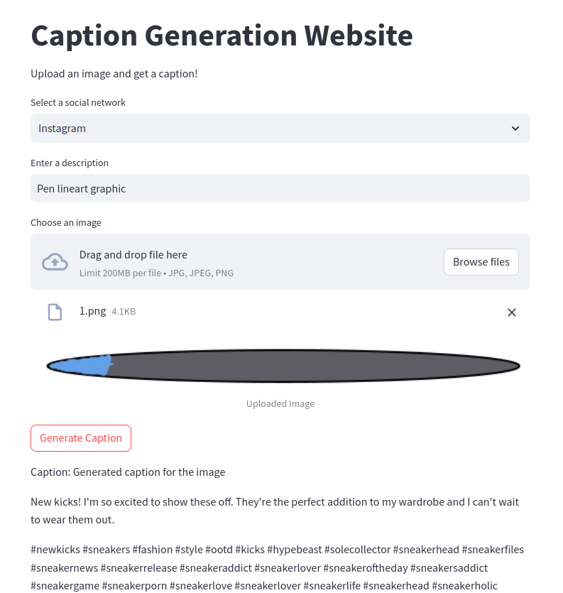

    <h1>Caption-Generator</h1>
    <h3>Using Generative A.I to make life easier</h3>
     

It's easy to generate a caption, simply select a social network from the dropdown menu, enter a description (optional, but reccomended) Input your image, and then click the "Generate Caption" button.

